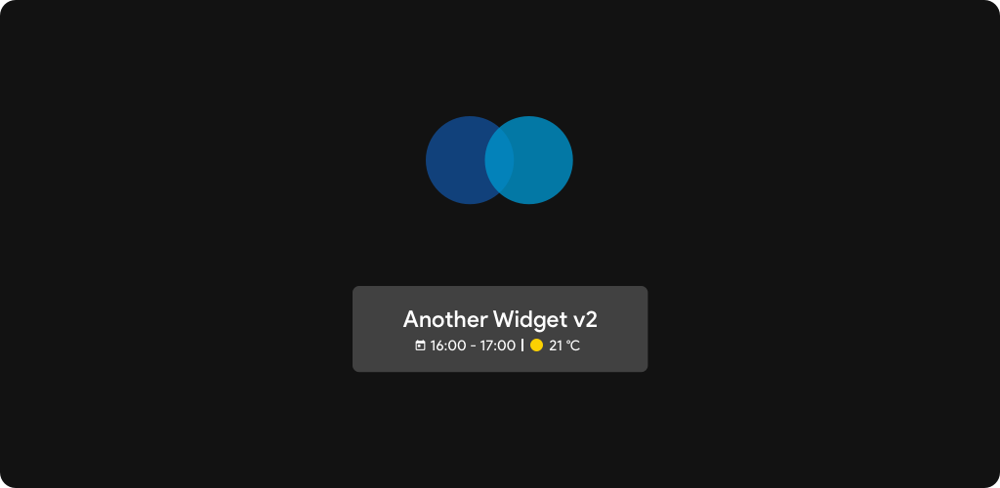

Another Widget
========

Another Widget intelligently summarizes the information you need most.
Watch the next events, the weather, and the information you want in an intuitive and elegant way. (Nope, reminders cannot be displayed because it's not allowed.)

While respecting the design of the application, there is a great opportunity to customize the information displayed and widget components.
Also, as much as possible, there are always updates and new features in the short run.

Help me developing with feedback and support me on how you can.

Help with translations
-------

Hey! You could view the file strings.xml ([here](https://github.com/tommasoberlose/another-widget/blob/master/app/src/main/res/values/strings.xml)) that contains the English version of the app strings.
You have to copy the file, create a copy of it inside the folder values-[LANGUAGE-SUFFIX] with the translated strings and create a pull request to submit your changes.

License
-------
Copyright (C) 2017-2020 Tommaso Berlose (http://tommasoberlose.com)

Another Widget binaries and source code can be used according to the [MIT Licence](LICENSE).
